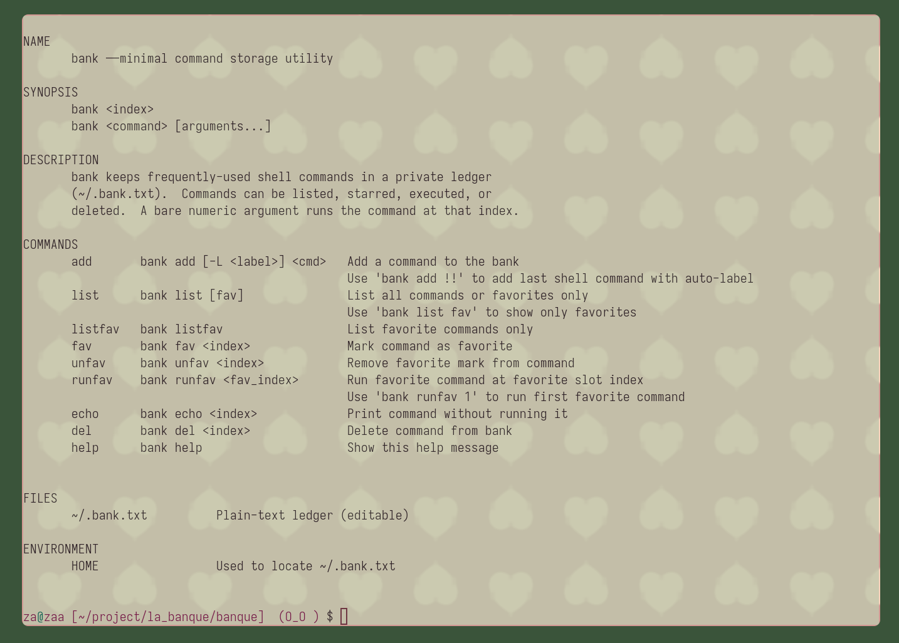

# Bank



Command storage and execution tool. Store frequently used commands and run them by index.

## Install

```bash
curl -sSL https://github.com/gen2-acidking/banque/install.sh | bash
```

- **Run 'banque' or 'banque help' in terminal for usage instructions.

## Features

- **Command Storage**: Save commands with auto or custom labels  
- **Favorites**: Mark frequently used commands as favorites  
- **Quick Execution**: Run commands by index number  
- **Persistent**: Commands stored in `~/.bank.txt`  
- **Shell Integration**: Works with bash and zsh  
